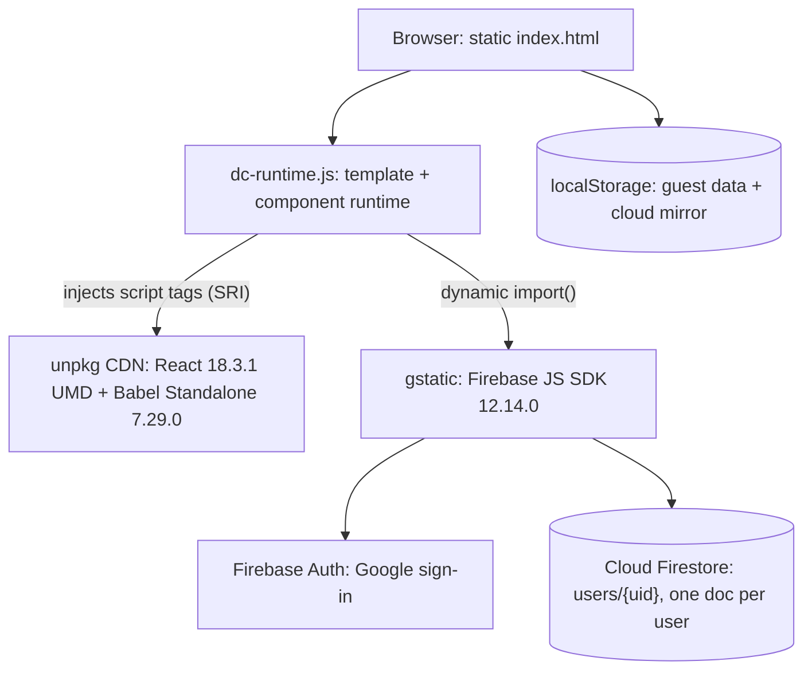

# Kanade

A flashcard app for learning the Japanese kana, both hiragana and katakana, in a Duolingo style. You choose which parts of the syllabary to drill, then run flashcard practice or a multiple choice quiz with hearts, combos, and a daily streak. Characters you miss get collected into a focused review set. It works as a guest with everything saved on the device, and if you sign in with Google your progress syncs across devices through Firestore.

**Live demo: https://kanade.clayborne.dev** (no account needed to try it).

Kanade is one of three apps built on the same engine. The siblings teach different writing systems: [Kazu](https://kazu.clayborne.dev) for Japanese numbers, counters, and dates, and [Baybayin](https://baybayin.clayborne.dev) for the pre-colonial Philippine script. This README covers Kanade and the shared engine underneath it. Kanade is the reference app of the three. I built it first and derived the other two from it, so its structure is the one the siblings follow.

<!-- SCREENSHOT / DEMO GIF GOES HERE -->
> **Demo placeholder:** add a screenshot of the quiz screen (hearts + combo badge) and a short GIF of a practice session here.

## What it teaches

The full kana set, 208 cards. Each of hiragana and katakana is split into four groups you can toggle on or off:

- **Basic (seion), 46.** The gojuon grid from a to n, including wo and n with their usage notes.
- **Voiced (dakuten), 20.** The ga, za, da, ba rows.
- **Semi-voiced (handakuten), 5.** The pa row.
- **Contracted (yoon), 33.** kya, sha, cho and the rest.

That is 104 characters per script, 208 in total across 8 selectable parts. The katakana set is not typed out by hand. It is derived from the hiragana table at load time by shifting each code point by `0x60` (the `toKata` helper), with a manual note fix for the rare wo (katakana). Every card carries the glyph, its romaji, a Korean gloss shown only in Korean mode, and an optional note (for example, wo is the object particle, n is the final n).

You can quiz in either direction, glyph to reading or reading to glyph, or a random mix. The Kana Chart screen shows the tables laid out properly and speaks a character aloud when you tap it.

## Architecture

There is no server of my own. The app is static files, and Firebase is the only backend.



Nothing is bundled in the deploy path. `dc-runtime.js` is prebuilt and checked in, React and Babel Standalone load from unpkg at runtime, and the Firebase SDK loads from gstatic through a dynamic `import()`. Deploying an update is a `git pull` with no build and no restart, which suits the shared host these apps live on.

`dc-runtime.js` is a small runtime compiled from TypeScript. It parses the `<x-dc>` template and a `DCLogic` component class out of `index.html` and renders them with React. The template has its own directives (`sc-if`, `sc-for`, `{{ }}` interpolation, and a `style-active` pressed state), and the component class is a plain React-style lifecycle: `componentDidMount`, `setState`, `forceUpdate`, and a `renderVals()` method that returns the view model the template binds to. The same runtime file is byte for byte identical across all three apps.

## Accounts and sync

This is the part with the most engineering in it. The goal was that a returning signed-in user never sees a loading screen, and that guest and cloud data cross over cleanly.

- **Guest mode** keeps the profile in `localStorage` and writes on every change. No account required, and it is fully functional on its own.
- **Cloud mode** stores the profile as a single Firestore document at `users/{uid}`. Sign-in is Google through Firebase Auth, using `signInWithPopup` with an automatic `signInWithRedirect` fallback when popups are blocked.
- **Boot is mirror first.** A returning cloud user reaches the home screen immediately from a `localStorage` mirror of their profile, before Firestore has answered. The app then reconciles in the background: it reads the Firestore local cache first, then the server copy under a timeout (short if it has not entered yet, longer if the mirror is already on screen).
- **First sign-in promotes the device's guest records** into the new cloud document, and the nickname becomes the Google display name. Sign out and you are back on your untouched guest profile.
- **Account-switch guard.** If the on-device mirror belongs to a different user id than the account that just signed in, the mirror is thrown away, so one account's progress can never leak into another's document.
- **Writes are debounced 2 seconds** and merged (`setDoc` with `merge: true`), then flushed on tab hide, page unload, and at the end of every session. Offline writes queue in the SDK's persistent local cache and retry. Firestore is initialized with forced long polling and a single-tab persistent cache, which keeps it working on networks that block streaming connections.

## Game mechanics

- **Practice** flips a card and you mark whether you knew it. Missed cards are saved for a one-tap retry at the end.
- **Quiz** gives six choices, selectable by mouse or keys 1 through 6. You start with **five hearts**; a wrong answer costs one, and running out ends the session early. A combo counter tracks your run of correct answers and the best combo is saved. **Hard mode** adds a per-question timer of 3, 5, or 7 seconds, and running out counts as wrong.
- **Review** collects any character seen at least 3 times with an error rate of 30% or higher, sorted worst first, and lets you drill just those.
- **My Page** shows a 17-week activity heatmap in the GitHub contribution style, totals and accuracy, days studied, the current streak, and a per-character error grid colored from green to red by an HSL hue.
- **Sound effects** (correct, wrong, combo, done, flip) are synthesized with the Web Audio API, so there are no audio files to ship. They can be turned off.
- **Keyboard:** Space or Enter reveals and advances in practice, X marks "didn't know," and 1 through 6 answer the quiz.

## Tech stack

**Frontend:** static HTML, CSS, and JavaScript. The UI is authored as an `<x-dc>` declarative template plus a `DCLogic` class, rendered by `dc-runtime.js`. React 18.3.1 (UMD) and Babel Standalone 7.29.0 come from unpkg, and Babel compiles the component script in the browser. Light and dark themes in CSS custom properties, auto-detected from `prefers-color-scheme` and toggleable. Brand color red `#E0483E`. Fonts Jua and M PLUS Rounded 1c from Google Fonts.

**Auth and data:** Firebase JS SDK 12.14.0 loaded from gstatic. Google sign-in and Cloud Firestore, project `japanese-site-a0af9`, document `users/{uid}`. The Firebase web config in the client is public by design; access is governed by Firestore security rules, not by hiding the config.

**Speech:** the Web Speech API (`SpeechSynthesis`), voice `ja-JP`, used when you tap a character in the chart.

**Language:** Korean and English UI, Korean by default with browser-language detection on first visit.

### localStorage keys

| Key | Purpose |
|---|---|
| `kanade-duo-guest` | Guest study profile (nick, per-character stats, activity, best combo) |
| `kanade-duo-cloud` | Local mirror of the signed-in profile for instant boot |
| `kanade-duo-mode` | `guest` or `cloud`, decides the entry path next visit |
| `kanade-duo-setup` | Study settings (parts, question direction, hard mode, time limit) |
| `kanade-duo-lang` / `kanade-duo-theme` / `kanade-duo-sound` | UI preferences |

On first run the app also imports any legacy `kanade-guest` records read only, so history from the earlier single-file version carries over without being written back.

## Running locally

These are static files, so any static server works:

```bash
cd kanade
python3 -m http.server 8000
# open http://localhost:8000
```

It needs internet access for the CDNs (React and Babel from unpkg, the Firebase SDK from gstatic, fonts from Google). Google sign-in only works from an authorized domain, so locally you use guest mode, which exercises everything except cloud sync. In production the app is served by Caddy as static files on a shared EC2 instance. An earlier single-file version of the app is kept in the repo next to `index.html` and is still served.

## Known limitations

- **No automated tests.** The honest gap.
- **React and Babel load from unpkg and compile in the browser.** This keeps the deploy build-free, but it ships a compiler to the client and makes cold start depend on unpkg being reachable. A real build step would remove both costs.
- **The whole profile is one Firestore document,** read and written as a single blob. Fine at this size; it would need splitting if the data grew large.
- **Text to speech depends on the device having a Japanese voice.** Without one the browser uses whatever fallback it has.
- **Review is a threshold rule** (seen count and error rate), not a spaced-repetition schedule.

## The family

Kanade, Kazu, and Baybayin are the same engine with different data and theming. The runtime file is identical across all three; each app ships its own data module, colors, Firestore collection, and storage prefix.

| App | Teaches | Cards | Brand color | Firestore | TTS |
|---|---|---|---|---|---|
| **Kanade** | Hiragana and katakana | 208 | Red `#E0483E` | `users/{uid}` | `ja-JP` |
| [Kazu](https://kazu.clayborne.dev) | Japanese numbers, counters, dates | 270 | Teal `#12A79E` | `kazu/{uid}` | `ja-JP` |
| [Baybayin](https://baybayin.clayborne.dev) | Baybayin script | 59 | Indigo `#5B54E8` | `baybay_users/{uid}` | `fil-PH` |

Repositories: [kanade](https://github.com/ClayborneYeounjunLee/kanade) | [kazu](https://github.com/ClayborneYeounjunLee/kazu) | [baybayin](https://github.com/ClayborneYeounjunLee/baybayin)
